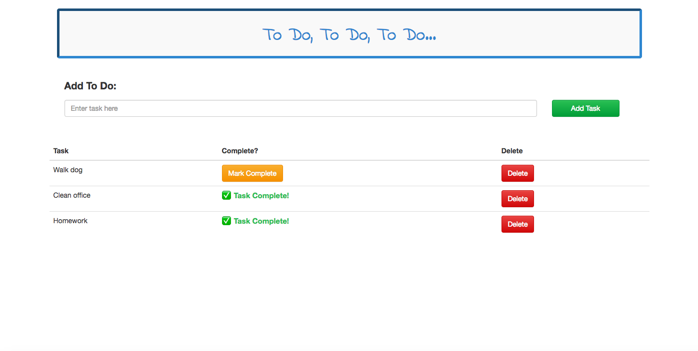

# To Do, To Do, To Do...Weekend 3 Challenge

An interactive "To Do List" application.  Allows users to input tasks to their "To Do List", check when completed and delete tasks.  Upon input of task - defaults that the task has not yet been completed.  

-[Live demo](https://cryptic-ocean-20996.herokuapp.com/)

## Built With

- PostgreSQL
- Express
- jQuery
- Node
- Bootstrap

## Getting Started

These instructions will get you a copy of the project up and running on your local machine for development and testing purposes. See deployment for notes on how to deploy the on a live system.

### Prerequisites

- [Node.js](https://nodejs.org/en/)
- [AngularJS](https://angularjs.org/)
- [PostgreSQL](https://www.postgresql.org/)
- [Express](http://expressjs.com/)
- [Bootstrap](https://getbootstrap.com/docs/3.3/)

### Installing

Steps to get the development environment running.

In a terminal window, navigate to the project folder once saved on your computer.
- Run `npm install`
- Make sure postgreSQL is running in an open terminal window
- `npm start`

```sql
CREATE TABLE "tasks" (
	"id" serial primary key,
	"todo" character varying,
	"completed" boolean
	);

```

## Screen Shot


### Completed Features

- [x] Users can add tasks.  Default to not complete upon adding.
- [x] Users can mark items complete.
- [x] Users can delete tasks.
